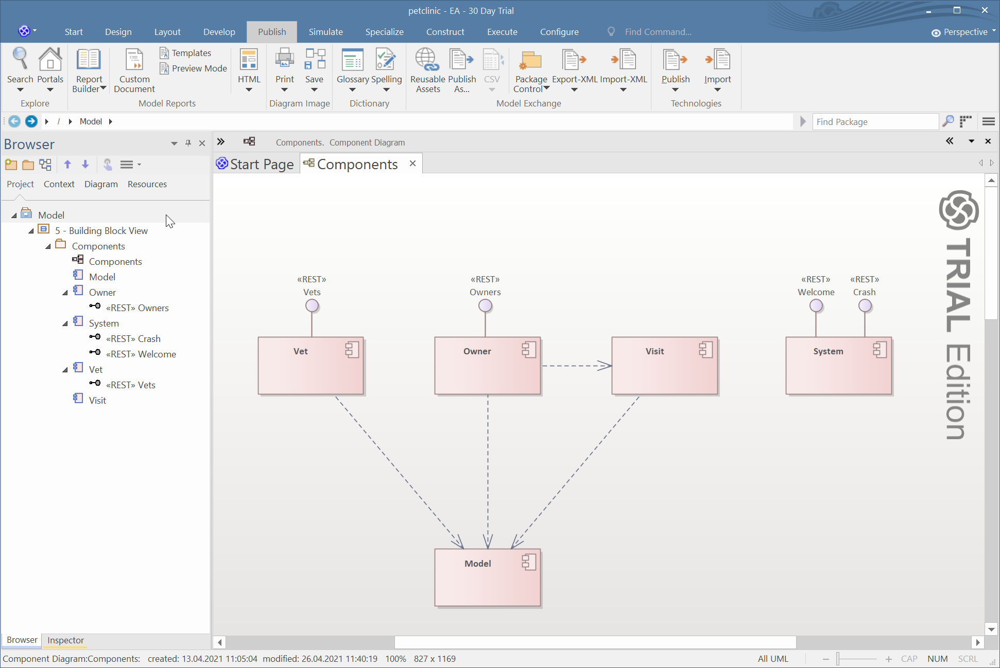
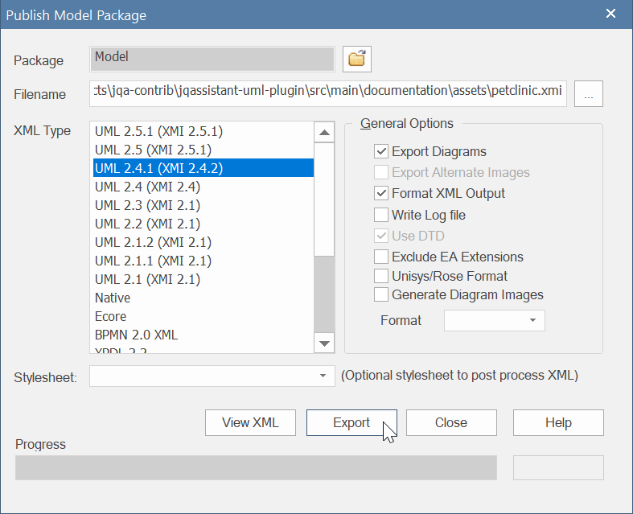
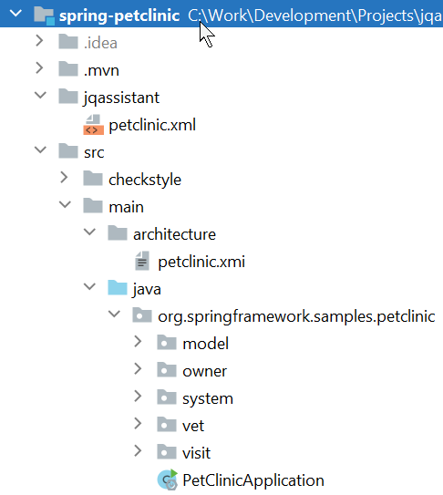

:toc:
= jQAssistant XMI Plugin

The http://jqassistant.org/[jQAssistant] XMI Plugin provides scanners and rules for importing UML models, e.g. from XMI files.
These models may be used by constraints to verify

== Prerequisites

* Java 8 or higher
* Maven 3.5.x or higher
* jQAssistant 1.9.0 or higher (see below)

== Setup

=== Maven

The plugin can be enabled by adding it as a dependency to the jQAssistant Maven plugin.

.pom.xml
[source,xml]
----
<build>
    <plugins>
        <plugin>
            <groupId>com.buschmais.jqassistant</groupId>
            <artifactId>jqassistant-maven-plugin</artifactId>
            <version>1.9.0</version>
            <executions>
                <execution>
                    <id>default-cli</id>
                    <goals>
                        <goal>scan</goal>
                        <goal>analyze</goal>
                    </goals>
                    <configuration>
                        <scanIncludes>                                                   <!--1-->
                            <scanInclude>
                                <path>${project.basedir}/src/main/xmi</path>
                            </scanInclude>
                        </scanIncludes>
                        <groups>
                            <group>xmi:UMLDefault</group>
                        </groups>
                    </configuration>
                </execution>
            </executions>
            <dependencies>
                <dependency>                                                             <!--2-->
                    <groupId>org.jqassistant.contrib.plugin</groupId>
                    <artifactId>jqassistant-xmi-plugin</artifactId>
                    <version>1.9.0-M1</version>
                </dependency>
            </dependencies>
        </plugin>
    </plugins>
</build>
----
<1> Adds a folder to be scanned by the jQAssistant Maven plugin, any contained `.xmi` file will be scanned.
<2> Declares the UML plugin as dependency.

=== Command Line Utility

Download the JAR file from https://search.maven.org/artifact/org.jqassistant.contrib.plugin/jqassistant-xmi-plugin[Maven Central] and put it into the `/plugins` folder of the distribution.

Executing the command `jqassistant.sh scan -f src/xmi/` (Linux) or `jqassistant.cmd scan -f src/xmi/` will scan any file with the extension ´.xmi´ located in the given folder.

== Usage Example

This section describes how a UML model contained in a XMI file can be used to:

* <<DefineTheModel>>,
* <<MapTheModelToCode>>
* <<ValidateTheCode>>

[[DefineTheModel]]
=== Define The Model

For the purpose of this example the https://github.com/spring-projects/spring-petclinic[Spring PetClinic Sample Application] is used.

The building blocks and their allowed dependencies are modeled as component diagram (in this case using https://sparxsystems.com/products/ea/[Sparx Systems Enterprise Architect]):

* The UML package `Components` contains the model elements used for validation

This model can be exported as XMI file in EA using the following steps:

1. Select the package to export (e.g. the `Model` node of the project):

image::src/main/documentation/assets/EA_Project.png[]

2. In the ribbon `Publish` click `Publish As...`

image::src/main/documentation/assets/EA_Publish.png[]

3. Choose the desired target folder and file name within your project (e.g. `src/main/xmi/petclinic.xmi`, see <<Maven>> configuration above), select `UML 2.x` as XML type and click `Export`:

TIP: The exported XMI file should be added to the version control of the project.

[[MapTheModelToCode]]
=== Map The Model to Code

Building the project will import...

* the code structures (e.g. Maven modules & artifacts, Java packages and classes)
* and the XMI model

These items are still disconnected graphs, i.e. independent of each other.
Therefore a mapping must be provided, this is done by defining project specific concept(s).

In case of the Spring PetClinic there is a root package `org.springframework.samples.petclinic` containing the application:

]

Each package within the root package of the application (main artifact) shall represent a component.
Therefore a concept `petclinic:Component` is defined which adds the label `Component` to each of these packages:

[source,xml]
----
include::src/main/documentation/assets/petclinic.xml[tags=petclinicComponent]
----

Based on it another concept `petclinic:ComponentDependency` propagates dependencies between Java types to the component level:

[source,xml]
----
include::src/main/documentation/assets/petclinic.xml[tags=petclinicComponentDependency]
----

NOTE: This concept requires the before defined concept `petclinic:Component`.

The concept `petclinic:ComponentDefinedByUMLComponent` maps the Java packages and the UML packages from the XMI model by simply matching their names:

[source,xml]
----
include::src/main/documentation/assets/petclinic.xml[tags=petclinicComponentDefinedByUMLComponent]
----

NOTE: This concept requires `petclinic:Component` as well as the pre-defined concepts `xmi:UMLPackage` and `xmi:UMLPackage` which are provided by this plugin.

This allows to use patterns expressing that a Java component is defined by an UML component:

`(component:Java:Component)-[:DEFINED_BY]->(umlComponent:UML:Component)`

[[ValidateTheCode]]
=== Validate Code Structures

Based on the defined concepts several constraints can be defined.

== Reference Documentation

=== XMI File Scanner

The plugin provides a scanner which accepts files with the extension `.xmi` and creates the structure as described in this section, using
<<XMIFile>> as entry point.

[[XMIFile]]
==== :XMI:File

Represents a XMI file.

[options=header]
.Properties of :XMI:File
|===
| Name     | Description
| fileName | The file name (relative to the directory which has been specified for scanning).
|===

[options=header]
.Relations of :XMI:File
|===
| Name                   | Target label(s)      | Cardinality | Description
| CONTAINS_DOCUMENTATION | <<XMIDocumentation>> | 0..1        | References the documentation.
| CONTAINS_UML_MODEL     | <<UMLModel>>         | 0..1        | References the contained UML model.
| CONTAINS_STEREOTYPE    | <<XMIStereotype>>    | 0..n        | References the contained stereotypes.
|===

[[XMIDocumentation]]
==== :XMI:Documentation

Provides meta-information about the XMI file.

[options=header]
.Properties of :XMI:Documentation
|===
| Name            | Description
| exporter        | The name of the tool which exported the XMI file, e.g. `Enterprise Architect`.
| exporterVersion | The version of the tool which exported the XMI file, e.g. `6.5`.
| exporterID      | The identifier of the tool which exported the XMI file, e.g. `1558`.
|===

[[XMIElement]]
==== :XMI:Element

Represents an XMI element.

NOTE: All UML elements described below (including the <<UMLModel>> itself) are <<XMIElement>>s.

[options=header]
.Properties of :XMI:Element
|===
| Name     | Description
| xmiId    | (optional) The unique id of the XMI element (any character sequence, e.g. a GUID)
| xmiType  | The type of the XMI element, e.g. `uml:PackagedElement`.
| name     | The name of the XMI element, e.g. `My Package`.
|===

[options=header]
.Relations of :XMI:Element
|===
| Name      | Target label(s) | Cardinality | Description
| HAS_CHILD | <<XMIElement>>  | 0..n        | References the children of this element, thus forming a tree-structured model.
|===

[[UMLModel]]
==== :UML:Model

Inherits from <<XMIElement>> and represents a UML model, where the model elements are children of this node, i.e. <<UMLPackagedElement>> or <<UMLProfileApplication>>

[[UMLPackagedElement]]
==== :UML:PackagedElement

Inherits from <<XMIElement>> and represents a packaged element. The type is determined by the property `xmiType` of <<XMIElement>>, e.g. `uml:Package`, `uml:Component`, `uml:Association`, `uml:Dependency` or `uml:Usage`.

Children of a <<UMLPackagedElement>> may be <<UMLOwnedAttribute>>, <<UMLOwnedEnd>>, <<UMLRequiredInterface>> or <<UMLProvidedInterface>>.

[options=header]
.Properties of :UML:PackagedElement
|===
| Name       | Description
| visibility | (optional) The visibility of this packaged element, e.g. `public`.
|===

[options=header]
.Relations of :UML:PackagedElement
|===
| Name                   | Target label(s) | Cardinality | Description
| HAS_CLIENT             | <<XMIElement>>  | 0..1        | References the client of this element if its type is a relation (e.g. `uml:Dependency`).
| HAS_SUPPLIER           | <<XMIElement>>  | 0..1        | References the supplier for this element if its type is a relation (e.g. `uml:Dependency`)
| HAS_INFORMATION_SOURCE | <<XMIElement>>  | 0..1        | References the information source of this element if its type is an information flow (i.e. `uml:InformationFlow`).
| HAS_INFORMATION_TARGET | <<XMIElement>>  | 0..1        | References the information target for this element if its type is an information flow (e.g. `uml:InformationFlow`)
|===

[[UMLOwnedAttribute]]
==== :UML:OwnedAttribute

Inherits from <<XMIElement>> and represents an owned attribute of a <<UMLPackagedElement>>, e.g. a `uml:Property` or `uml:Port`.

Children of a <<UMLOwnedAttribute>> may be <<UMLRequiredInterface>> or <<UMLProvidedInterface>>.

[options=header]
.Properties of :UML:OwnedAttribute
|===
| Name        | Description
| aggregation | (optional) The aggregation type of this attribute, e.g. `composite`.
|===

[options=header]
.Relations of :UML:OwnedAttribute
|===
| Name            | Target label(s) | Cardinality | Description
| FOR_ASSOCIATION | <<XMIElement>>  | 0..1        | References a <<UMLPackagedElement>> with xmiType `uml:Association` if this owned attribute is part of an association.
| OF_TYPE         | <<XMIElement>>  | 0..1        | References the type of this owned property.
|===

[[UMLOwnedEnd]]
==== :UML:OwnedEnd

Inherits from <<XMIElement>> and represents an owned end of a <<UMLPackagedElement>>, e.g. a `uml:Property`.

Children of a <<UMLOwnedEnd>> may be <<UMLRequiredInterface>> or <<UMLProvidedInterface>>.

[options=header]
.Properties of :UML:OwnedEnd
|===
| Name        | Description
| aggregation | (optional) The aggregation type of this attribute, e.g. `composite`.
|===

[options=header]
.Relations of :UML:OwnedEnd
|===
| Name            | Target label(s) | Cardinality | Description
| FOR_ASSOCIATION | <<XMIElement>>  | 0..1        | References a <<UMLPackagedElement>> with xmiType `uml:Association` if this owned attribute is part of an association.
| OF_TYPE         | <<XMIElement>>  | 0..1        | References the type of this owned property.
|===

[[UMLRequiredInterface]]
==== :UML:Interface:Required

Inherits from <<XMIElement>> and represents an required interface of a <<UMLPackagedElement>>, <<UMLOwnedAttribute>> or <<UMLOwnedEnd>>.

[[UMLProvidedInterface]]
==== :UML:Interface:Provided

Inherits from <<XMIElement>> and represents an provided interface of a <<UMLPackagedElement>>, <<UMLOwnedAttribute>> or <<UMLOwnedEnd>>.

[[UMLProfileApplication]]
==== :UML:ProfileApplication

Inherits from <<XMIElement>> and represents a profile application.

[options=header]
.Relations of :UML:ProfileApplication
|===
| Name            | Target label(s)       | Cardinality | Description
| APPLIES_PROFILE | <<UMLAppliedProfile>> | 1           | References the applied profile.
|===

[[UMLAppliedProfile]]
==== :UML:AppliedProfile

Inherits from <<XMIElement>> and represents an applied profile.

[options=header]
.Properties of :UML:AppliedProfile
|===
| Name | Description
| href | The HREF of the applied profile, e.g. `http://www.sparxsystems.com/profiles/thecustomprofile/1.0#thecustomprofile`.
|===

[[XMIStereotype]]
==== :XMI:Stereotype

Represents a stereotype.

[options=header]
.Properties of :XMI:Stereotype
|===
| Name            | Description
| name            | The name of the stereotype.
| namespaceUri    | The namespace URI of the stereotype, e.g. `http://www.sparxsystems.com/profiles/thecustomprofile/1.0`.
| namespacePrefix | The namespace prefix of the stereotype, e.g. `thecustomprofile`.
|===

[[XMIAppliedStereotype]]
==== :XMI:AppliedStereotype

Inherits from <<XMIElement>> and represents an application of a <<XMIStereotype>> to an <<XMIElement>>

[options=header]
.Relations of :UML:AppliedStereotype
|===
| Name          | Target label(s)   | Cardinality | Description
| OF_STEREOTYPE | <<XMIStereotype>> | 1           | References the applied stereotype.
| APPLIED_TO    | <<XMIElement>>    | 1           | References the element to which the stereotype is applied.
|===

=== Concepts

The plugin provides concepts for extracting UML models, e.g. for

* labeling `:UML:PackagedElement` nodes having `xmiType=uml:Component` as `:UML:Component`.
* creating `(:UML:Component)-[:HAS_DEPENDENCY]->(:UML:Component)` relations from `:PackagedElement` nodes having `xmiType=uml:Dependency`.

The rules including their descriptions are defined in the file link:src/main/resources/META-INF/jqassistant-rules/xmi.xml[/META-INF/jqassistant-rules/xmi.xml].

Furthermore a group `xmi:UML` is provided which allows easily applying all UML related concepts.

[[feedback]]
== Feedback

Please report any issues https://github.com/jqassistant-contrib/jqassistant-xmi-plugin/issues[here].

